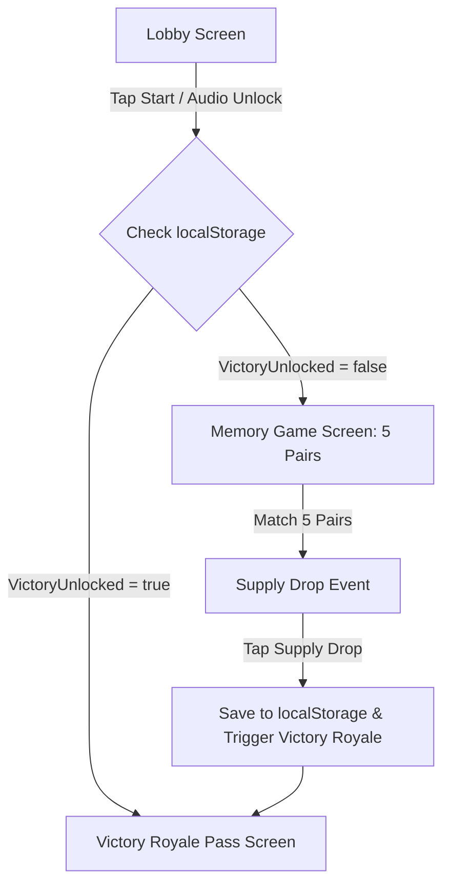

# Samsonite - Technical Architecture Document

## 1. Executive Overview
**Samsonite** is a client-side, mobile-optimized Fortnite-themed web game built for a 10th birthday present ("Sam 10"). It is hosted statically via GitHub Pages from the repository `https://github.com/dankar120-design/Samsonite.git`.

Upon accessing the site on an iPhone, the birthday boy experiences a multi-stage interactive journey:
1. **Fortnite Lobby & Audio Unlock**: Player card `SAM | LEVEL 10`, starting Web Audio context.
2. **Fortnite Memory Challenge**: 10 cards (5 matching pairs) with crisp inline SVG icons.
3. **Supply Drop Unboxing**: An animated Fortnite Supply Drop descends with sound effects, opened by tapping.
4. **Victory Royale & 300 SEK Amazon Victory Pass**: Particle confetti explosion, Victory Royale fanfare, and an animated 300 SEK Amazon credit pass.

---

## 2. Technical Stack
- **Core Technology**: Vanilla HTML5, CSS3, JavaScript (Classic scripts, no ES modules to avoid GitHub Pages MIME traps).
- **Audio Engine**: 100% Web Audio API Synthesis. No external MP3 files. Eliminates latency, pre-loading requirements, and network dependencies. Generates clicks, drops, and a pentatonic Victory fanfare instantly.
- **Visuals & VFX**: `canvas-confetti` (loaded securely via CDN with SRI), inline SVG vector strings in JavaScript (zero network requests), CSS Keyframe 60fps animations.
- **Persistence**: `localStorage` (saves game state). If `SamsoniteVictoryUnlocked` is true, returning visitors skip straight to the Victory Pass.
- **Deployment**: GitHub Pages (Static hosting root index.html).

---

## 3. System Architecture & State Machine



---

## 4. Directory & File Structure

```
Samsonite/
├── index.html                    # Main Single Page Application entrypoint
├── ARCHITECTURE.md               # System Architecture specification
├── decision_ledger.md            # AG 2.0 Decision Ledger
├── css/
│   ├── main.css                  # Design system tokens & layout
│   └── components.css            # Memory cards, Supply Drop, Victory Pass animations
└── js/
    ├── app.js                    # State Machine Controller & DOM Router
    ├── memory.js                 # Memory game engine (shuffle, flip, match logic)
    ├── audio.js                  # 100% Web Audio API Synth Engine
    └── assets.js                 # Exported inline SVG strings
```

---

## 5. Mobile Safari (iPhone) Optimizations
- `viewport` setup with `user-scalable=no, viewport-fit=cover` to prevent accidental zooming during rapid tapping.
- Visual touch feedback via CSS transforms (CSS shaking instead of `navigator.vibrate()`).
- Audio context initialization attached to the primary "START BATTLE PASS" touch event.
- Background suspension recovery: Resumes Web Audio context on `visibilitychange` events.
